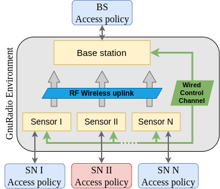
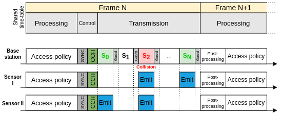

# gr_ephyl v2 / S3CAP project
This project is an adaptation of the [gr_ephyl](https://raweb.inria.fr/rapportsactivite/RA2019/maracas/uid47.html) project, creating a slotted and uplink framework to work on PHY or MAC layer.

 

## Installation
To install the slotted framework (GNURadio3.7) you must run the following command : 

```bash
git clone https://github.com/AmauryPARIS/gr-ephyl.git
cd gr-ephyl/
mkdir build && cd build
cmake -DCMAKE_INSTALL_PREFIX=/cortexlab/toolchains/current ..
make install
```

If you want to run the framework within the [FIT/CorteXlab](https://wiki.cortexlab.fr/doku.php) testbed, you should install the project within this provided [docker image](https://hub.docker.com/r/m1mbert/cxlb-gnuradio-3.7)
```bash
docker pull m1mbert/cxlb-gnuradio-3.7
docker run -dti --net=host --expose 2222 --privileged m1mbert/cxlb-gnuradio-3.7:1.0
```

This will enable the usage of the main OOT blocks of the ephyl/s3cap project. If you want to use the available LoRa PHY layer (based on this [project](https://github.com/AmauryPARIS/LoRa_PHY_Cxlb)), you also need to install it. You can follow the installation step (don't forget to source `setpaths.sh`). 

### GNU Radio hier blocks
Depending on the flowgraph you would like to use, generating the python executable of the needed hierarchical block will be required. 

## Usage 
This project offers a slotted and uplink transmission from multiple nodes to a base station. For each frame, the access policy of the MAC layer will set packets to be transmitted on chosen slots, and control messages. Then the PHY layer will generate and transmit all needed signals during the slotted time frame, to be finally received by the base station. Both nodes and the base station use the results of the previous frame to decide their next actions.   

 

### MAC layer
The S3CAP framework provides easy implementation of MAC layers. Exemples are provided in the (poorly named) `upper` folder. 
- `upper_class.py` is a set of function to exchange information and instruction between your MAC layer (yours to implement) and the PHY layer (inside the GNU Radio environment)
- `sn_upper.py` is a dummy MAC layer for each sensor to set transmission of packets on the slotted uplink channel and control messages
- `bs_upper.py` is also a dummy MAC layer for the base station to set control messages

You can implement your own MAC layer by using the `upper_class`, as it is presented in `sn_upper.py` and `bs_upper.py`. The MAC layer will work regardless of the used PHY layer (LoRa and NB IoT are provided, but you can also use your own project -- see below)

### PHY Layer 
Two LoRa and NBIoT PHY layers are provided in this project. If you are only working on MAC, the nature of the PHY layer might not be of any interest to you and you should feel free to use LoRa, as presented below. However if you want to use another PHY layer, this is doable. 

The framework is built so that the signal to be transmitted by a node is generated in advance and stored in the OOT block `sn_scheduler.py`. To implement a new PHY layer within the framework, you need to :
1. Replace the `LoRa TX chain` hier block with your own PHY layer in the `hier_sn_lora.grc` flowgraph
2. Update the `stream_to_tagged_stream` packet length parameter in the `hier_sn_lora.grc` flowgraph and the `handle_msg` function in the OOT block `sn_scheduler.py` to compute the length of your generated signal, so that it can be stored before being send
3. Replace the `LoRa RX chain` hier block with your own PHY layer in the `hier_bs_lora.grc` flowgraph

## Exemple

### Run it with LoRa in local

If you want to run the project on your local computer, use "demo_local_lora.grc" to get started. In this exemple flowgraph you will find two LoRa nodes transmitting at a base station in the slotted environment of the S3CAP framework. This is the PHY layer and with it we need a MAC layer to set packets and control messages (`sn_upper.py` and `bs_upper.py`). Thereefor, to run this exemple, you should run, in this order and in separate terminals, the following commands : 

```bash
$ python PATH_TO/gr-ephyl/upper/bs_upper.py
$ python PATH_TO/gr-ephyl/upper/bs_upper.py
$ python PATH_TO/gr-ephyl/examples/LoRa/demo_loop_lora.py
```

### Run it with LoRa in FIT/CorteXlab 

To run the project in the FIT/CorteXlab testbed, you should first follow some [tutorials](https://wiki.cortexlab.fr/doku.php?id=tutorials) to get familiar with its environment. After that, you can run a dummy scenario with two transmitting nodes and a base station.

- On `NODE_X` - the first sensor
```bash
python2 /root/cxlb_toolchain_build/gr-ephyl/upper/sn_upper.py --slot_count=4 &
python2 /root/cxlb_toolchain_build/gr-ephyl/examples/LoRa/sn_multislot_dyn_ephyl_lora.py --sn-id=A --ip-bs-addr=NODE_Z --S=4
```
- On `NODE_Y` - the second sensor
```bash
python2 /root/cxlb_toolchain_build/gr-ephyl/upper/sn_upper.py --slot_count=4 &
python2 /root/cxlb_toolchain_build/gr-ephyl/examples/LoRa/sn_multislot_dyn_ephyl_lora.py --sn-id=B --ip-bs-addr=NODE_Z --S=4
```
- On `NODE_Z` - the base station
```bash
python2 /root/cxlb_toolchain_build/gr-ephyl/upper/bs_upper.py --slot_count=4 &
python2 /root/cxlb_toolchain_build/gr-ephyl/examples/LoRa/bs_multisn_multislot_dyn_ephyl_lora.py --sn-1-ip-addr=NODE_X --sn-2-ip-addr=NODE_Y --S=4
```

## Documentation 
Detailed documentation is available in the `documentation folder` and [here](https://hal.inria.fr/hal-03876369)

## Known error

If you get the `ImportError: No module named lora_sdr` error, you should update and run the following command. You can also add it to your `.bashrc` for a more permanent setup. 
```bash
source PATH_TO/LoRa_PHY_Cxlb/gr-lora_sdr/apps/setpaths.sh
```

## TODO 
The synchronization precision could be improved by using the `rx_time` tag in reception to compute the sample count for each time slot.


